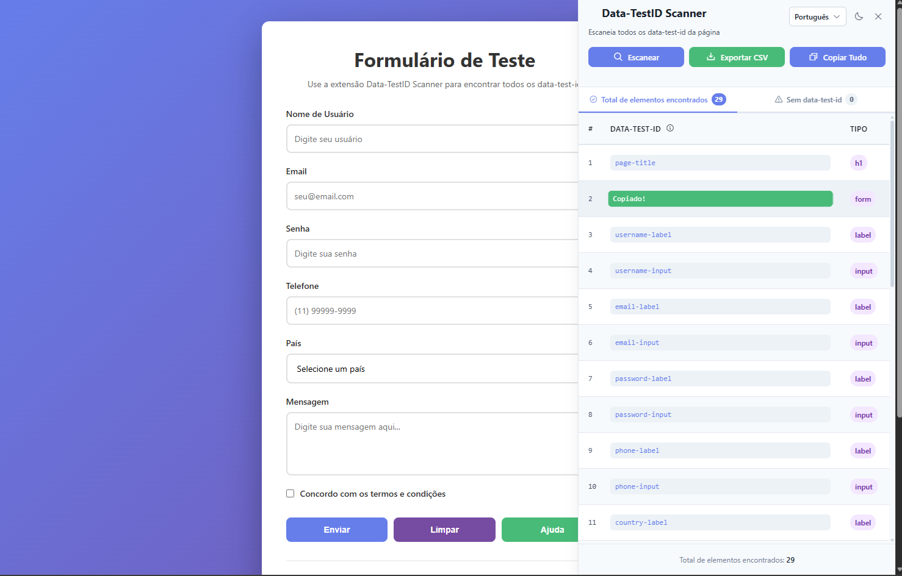
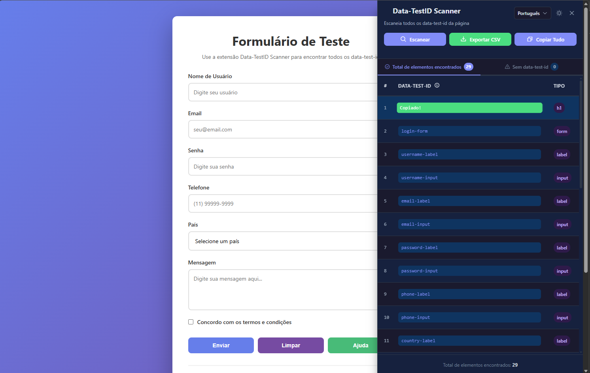

# Data-TestID Scanner

Browser extension for Chrome and Edge that scans and lists all `data-test-id` attributes from any webpage in an interactive sidebar. Built for developers and QA engineers working with test automation.


## Features

- **Scan** all `data-test-id` attributes from any page with one click
- **Interactive table** showing each test ID, element type, and copy action
- **Copy** individual IDs or all results to clipboard
- **Export CSV** with timestamped filename
- **Toggle sidebar** via floating button (FAB), toolbar icon, or close button
- **3 languages** — Portuguese, English, Spanish — with persistent preference
- **Responsive** — full sidebar on desktop, bottom panel on mobile
- **Offline** — zero external dependencies, Phosphor Icons bundled locally
- **Slide animations** for open/close transitions

## Installation

1. Clone the repository:
   ```bash
   git clone https://github.com/sidneyspe/data-testid-scanner.git
   ```
2. Open `chrome://extensions/` in Chrome (or `edge://extensions/` in Edge)
3. Enable **Developer mode**
4. Click **Load unpacked** and select the project root folder
5. The extension icon appears in the toolbar

## Usage

1. Navigate to any webpage
2. Click the **extension icon** in the toolbar or the **floating button** on the page
3. Click **Escanear** (Scan) to extract all `data-test-id` elements
4. Use the table to:
   - Copy individual IDs with the copy button
   - Copy all results with **Copiar Tudo**
   - Export to CSV with **Exportar CSV**
5. Change language via the dropdown in the header
6. Close the sidebar with the **X** button or by clicking the floating button again

## Screenshots

### Light mode



### Dark mode



## Project Structure

```
data-test-id-scan/
├── assets/
│   └── icons/                    # Extension icons (16, 48, 128px)
├── src/
│   ├── background.js             # Service worker — toolbar click, messaging
│   ├── content/
│   │   ├── sidebar.js            # Content script — DOM injection, toggle, scan
│   │   └── sidebar-controller.js # UI logic — table, export, copy, alerts
│   ├── i18n/
│   │   └── i18n.js               # Translation system (PT/EN/ES)
│   ├── ui/
│   │   ├── sidebar.html          # Sidebar + FAB template
│   │   └── styles.css            # Design system with CSS variables
│   └── vendor/
│       └── phosphor/             # Phosphor Icons (font + CSS, bundled)
├── test/
│   └── test-page.html            # Demo page with sample data-test-id elements
├── manifest.json                 # Chrome Extension Manifest V3
└── package.json
```

## Architecture

```
┌─────────────────┐     message      ┌──────────────────┐
│  background.js   │ ──────────────> │   sidebar.js      │
│  (service worker)│  toggleSidebar  │  (content script)  │
└─────────────────┘                  │                    │
                                     │  injects HTML/CSS  │
                                     │  loads Phosphor     │
                                     │  toggles sidebar    │
                                     └────────┬───────────┘
                                              │ dts-ready event
                                     ┌────────▼───────────┐
                                     │ sidebar-controller  │
                                     │  scan, copy, export │
                                     │  i18n, alerts, table│
                                     └────────────────────┘
```

**Content scripts** run in Chrome's isolated world, sharing the DOM but not the JS context of the page. All three scripts (`i18n.js`, `sidebar.js`, `sidebar-controller.js`) are declared in `manifest.json` so they execute in the same isolated world and can share `window.I18N`.

## Tech Stack

- **Vanilla JavaScript** (ES6+) — no frameworks, no build step
- **CSS Custom Properties** — full design system with colors, spacing, typography
- **Phosphor Icons** — 4700+ icons, font bundled locally (~225KB)
- **Chrome Extension APIs** — `scripting`, `storage`, `tabs`, `runtime`
- **FontFace API** — dynamic font loading for CSP compliance
- **Clipboard API** — copy to clipboard
- **Blob API** — CSV file generation

## Development

```bash
# Lint
npm run lint

# Format
npm run format

# Test — open the demo page in the browser
npm run test
```

To test changes, reload the extension in `chrome://extensions/` after modifying files.

## Browser Support

| Browser | Minimum Version |
|---------|----------------|
| Chrome  | 88+            |
| Edge    | 88+            |

## License

MIT
